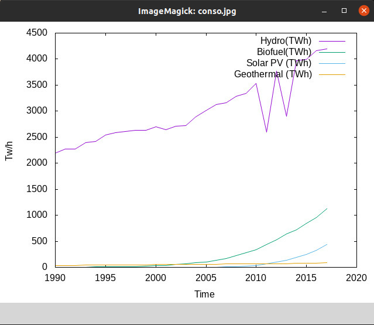

# Projet Script Shell Pays/Continents
---

Auteurs : Quentin Ducoulombier, Lucas Thu Ping One  
Date: 21 janvier 2022  
Email: ducoulombi@cy-tech.fr, thupingone@cy-tech.fr

---
## Présentation

Ce projet permet l’exploitation de fichiers .csv contenant des informations
énergétiques selon des pays/continents et/ou selon le temps.  
Notre projet permet de représenter ces données à l'aide de graphiques pour les illustrer et les comparer. De plus, à l'aide de certaines commandes, nous avons accès plus facilement aux données (par exemple la consommation totale d’une certaine énergie renouvelable).  
Tout ceci est possible grâce à un script clair et un menu.  
  
Exemple graphique :
  


## Technologie utilisée

Afin de mener à bien notre projet nous avons utilisé plusieurs technologies comme gnuplot pour créer des représentations graphiques des données que l’on étudie et gitlab pour pouvoir travailler ensemble sur le projet très facilement. Nous avons en effet créé un script qui nous permet de partager et mettre à jour rapidement les modifications apportées.

## Installation 

Le script doit être exécuté de la manière suivante :

- Ouvrir un terminal
- Se placer dans le répertoire du projet.
- Exécuter la commande :
  ```
  >> bash LeScript.sh 
  ```
- Attendre que le menu s'affiche
- Choisir la commande à exécuter !
- Attention :   
    Il faut choisir des numéros pour selectioner le menu:  
    - Dans "2) - Etude de la consommation d'un pays/continent par année -" il faut selectionner un pays ou continent selon la liste ci-dessous.
    - Dans "3) - Production d'une énergie renouvelable en TWh -" Il faut selectionner l'énergie en toutes lettres selon la liste affichée.
    - Dans "4) - Comparaison de l'évolution des énergies renouvelables par année -" Il faut selectionner l'énergie en nombre selon la liste affichée


Liste des pays et continents disponibles :
- Continents : World, OECD, BRICS, Europe, North America, Latin America, Asia, Pacific, Africa, Middle-East, CIS
- Pays : China,  United States,  Brazil,  Belgium,  Czechia, France, Germany, Italy, Netherlands, Poland, Portugal, Romania, Spain, Sweden, United Kingdom, Norway, Turkey, Kazakhstan, Russia, Ukraine, Uzbekistan, Argentina, Canada, Chile, Colombia, Mexico, Venezuela, Indonesia, Japan, Malaysia, South Korea, Taiwan, Thailand, India, Australia, New Zealand, Algeria, Egypt, Nigeria, South Africa, Iran, Kuwait, Saudi Arabia, United Arab Emirates.

## Autres

Pour plus d'information telecharger le document [Rapport_Script_Schell.pdf](./Rapport_Script_Shell.pdf)
